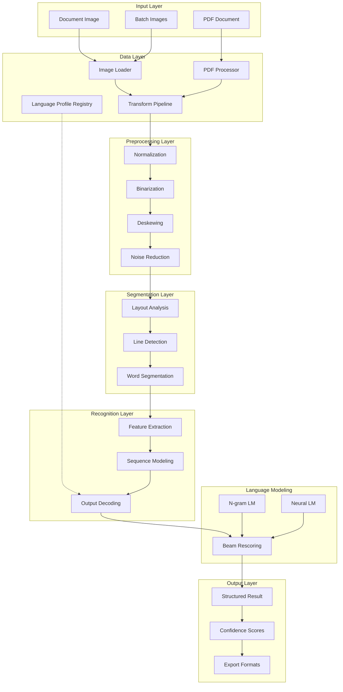
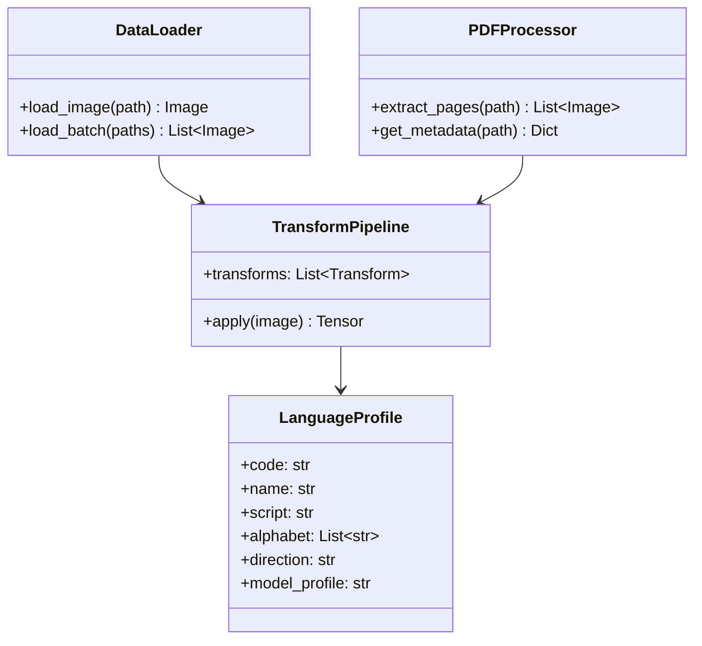
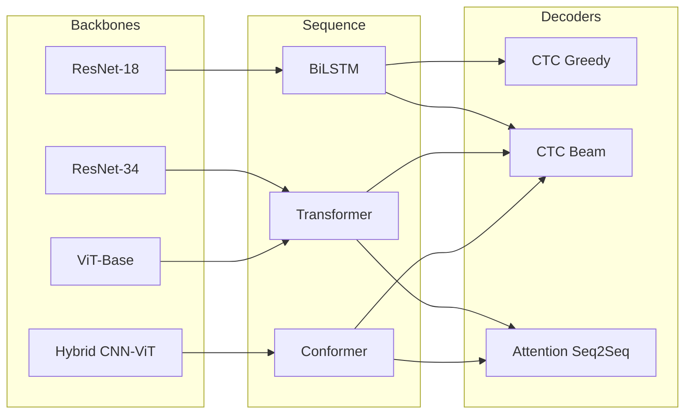
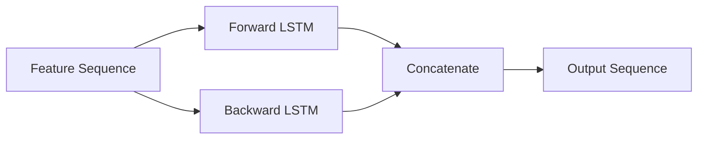
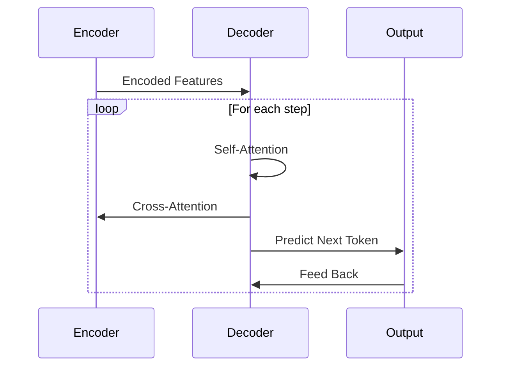
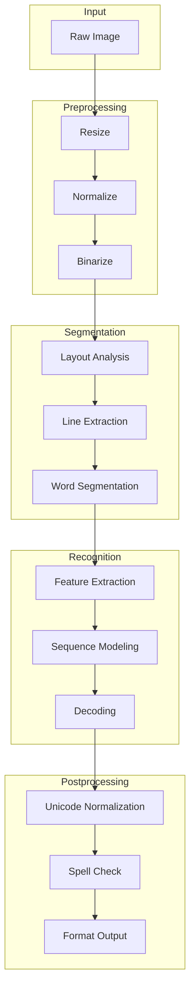
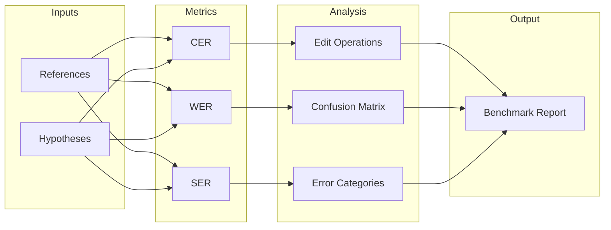
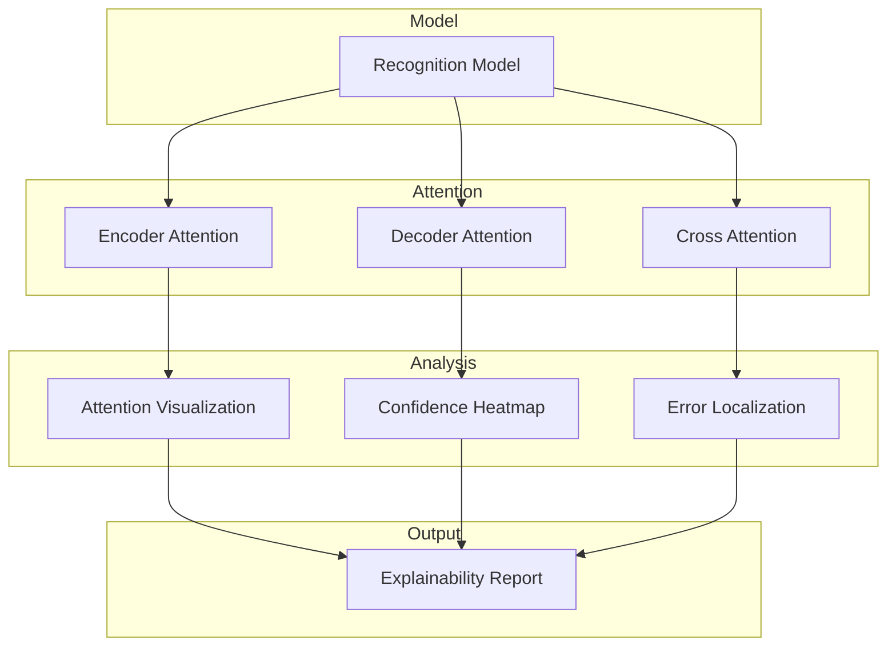

# Thulium Architecture

## System Overview

Thulium implements a layered architecture for handwritten text recognition, designed for modularity, extensibility, and production reliability.

---

## High-Level Architecture



---

## Module Structure

| Module | Path | Responsibility |
|:-------|:-----|:---------------|
| API | `thulium.api` | High-level recognition interface |
| Data | `thulium.data` | Data loading, transforms, language profiles |
| Models | `thulium.models` | Neural network architectures |
| Pipeline | `thulium.pipeline` | End-to-end processing orchestration |
| Evaluation | `thulium.evaluation` | Metrics, benchmarking, reporting |
| XAI | `thulium.xai` | Explainability and error analysis |
| CLI | `thulium.cli` | Command-line interface |

---

## Data Layer

### Component Hierarchy



### Language Profile Schema

Each supported language is defined by a `LanguageProfile` dataclass:

| Field | Type | Description |
|:------|:-----|:------------|
| `code` | str | ISO 639-1 code |
| `name` | str | Human-readable name |
| `script` | str | Writing system |
| `alphabet` | List[str] | Character set |
| `direction` | str | LTR or RTL |
| `region` | str | Geographic region |
| `model_profile` | str | Default model config |
| `tokenizer_type` | str | char, bpe, or word |
| `default_decoder` | str | Decoder variant |

---

## Model Layer

### Architecture Variants



### Backbone Architectures

#### Convolutional Neural Networks

ResNet-based feature extraction with asymmetric pooling for text line images:

```
Input: (B, C, H, W)
  --> Conv Layers --> Residual Blocks --> Pooling
Output: (B, C', H', W')
```

Feature map dimensions are computed as:

```
H' = H / s_h
W' = W / s_w
```

Where s_h and s_w are the total vertical and horizontal strides.

#### Vision Transformer

Patch-based encoding with positional embeddings:

```
Input: (B, C, H, W)
  --> Patch Embedding --> Positional Encoding --> Transformer Blocks
Output: (B, N, D)
```

Patch sequence length:

```
N = (H / P_h) * (W / P_w)
```

Where P_h and P_w are patch dimensions.

### Sequence Heads

#### BiLSTM

Bidirectional LSTM for sequential feature modeling:



#### Transformer

Self-attention based sequence modeling:

```
Attention(Q, K, V) = softmax(QK^T / sqrt(d_k)) V
```

Multi-head attention with positional encoding:

```
MultiHead(Q, K, V) = Concat(head_1, ..., head_h) W^O
head_i = Attention(QW_i^Q, KW_i^K, VW_i^V)
```

### Decoders

#### CTC Decoder

Connectionist Temporal Classification enables alignment-free training:

```
P(y|x) = sum_{pi in B^{-1}(y)} P(pi|x)
```

Where B is the many-to-one mapping that removes blanks and repeated characters.

**Beam Search** maintains top-k hypotheses with optional language model rescoring:

```
score(h) = log P(h|x) + alpha * log P_LM(h) + beta * |h|
```

#### Attention Decoder

Autoregressive sequence generation with cross-attention:



---

## Pipeline Layer

### Pipeline Architecture



### Configuration System

Pipelines are fully specified through YAML configuration:

```yaml
pipeline:
  name: htr_default
  
  preprocessing:
    target_height: 64
    normalize: true
    binarize: false
    
  model:
    backbone: resnet34
    sequence_head: transformer
    decoder: ctc_beam
    
  decoding:
    beam_width: 20
    lm_alpha: 0.5
    lm_beta: 0.1
    
  language:
    profile: en
```

---

## Evaluation Layer

### Metrics Framework



### Metric Definitions

**Character Error Rate (CER)**:

```
CER = (S + D + I) / N
```

Where:
- S = substitutions
- D = deletions
- I = insertions
- N = reference length

**Word Error Rate (WER)**:

```
WER = (S_w + D_w + I_w) / N_w
```

Applied at word-level tokenization.

**Cross-Language Fairness**:

```
Delta_CER = max_l(CER_l) - min_l(CER_l)
Sigma_CER = sqrt(1/L * sum_l(CER_l - mean_CER)^2)
```

---

## XAI Layer

### Explainability Components



---

## Design Principles

| Principle | Implementation |
|:----------|:---------------|
| **Modularity** | Components are independently replaceable |
| **Configurability** | YAML-based specification for reproducibility |
| **Type Safety** | Comprehensive type hints throughout |
| **Testability** | Unit and integration test coverage |
| **Extensibility** | New languages require only profile definition |
| **Performance** | Optimized inference with batching support |

---

## Technology Stack

| Component | Technology |
|:----------|:-----------|
| Deep Learning | PyTorch 2.0+ |
| Image Processing | Pillow, OpenCV |
| PDF Processing | pdf2image |
| CLI | Typer |
| Configuration | PyYAML, Pydantic |
| Testing | pytest |

---

## References

1. Graves, A., et al. (2006). Connectionist temporal classification.
2. Vaswani, A., et al. (2017). Attention is all you need.
3. Dosovitskiy, A., et al. (2020). An image is worth 16x16 words.
4. Gulati, A., et al. (2020). Conformer: Convolution-augmented Transformer.
