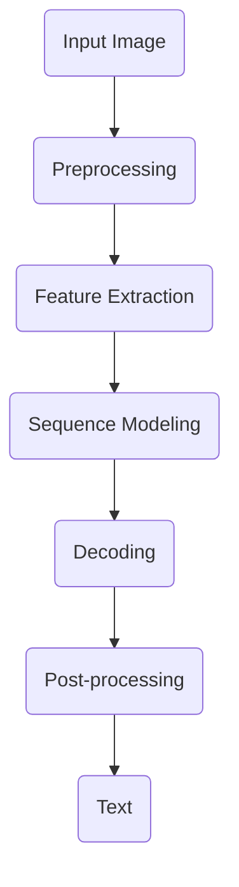
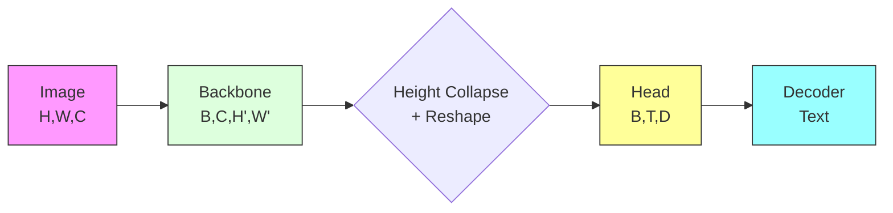

# Architecture

This document describes the high-level architecture of Thulium.

## System Overview



## Component Architecture

### 1. Input Layer

**Image Preprocessing**
- Grayscale conversion
- Binarization (Otsu/adaptive)
- Deskewing and normalization
- Height normalization to 64px

**Data Loading**
- `ImageDataset` — Generic image/text pairs
- `IAMDataset` — IAM Handwriting Database format
- `Lazy loading` with caching

### 2. Feature Extraction (Backbone)

| Backbone | Description | Output Shape |
|----------|-------------|--------------|
| `ResNetBackbone` | CNN with residual blocks | (B, C, H/8, W/8) |
| `ViTBackbone` | Vision Transformer patches | (B, Seq, D) |

### 3. Sequence Modeling (Head)

| Head | Description | Context |
|------|-------------|---------|
| `BiLSTMHead` | Bidirectional LSTM | Local + sequential |
| `TransformerHead` | Self-attention encoder | Global |
| `ConformerHead` | Conv + attention hybrid | Local + global |

### 4. Decoding

| Decoder | Description | Use Case |
|---------|-------------|----------|
| `CTCDecoder` | Connectionist Temporal Classification | Fast inference |
| `AttentionDecoder` | Seq2Seq with attention | Higher accuracy |

**Language Model Integration**
```
Score(y) = log P_HTR(y|x) + α·log P_LM(y) + β·|y|
```

### 5. Post-processing

- CTC blank removal
- Character merging
- Language-specific normalization
- Spell correction (optional)

## Module Structure

```
thulium/
├── api/              # High-level API
│   ├── recognize.py  # recognize_image, recognize_pdf
│   └── types.py      # RecognitionResult, LineResult
├── data/             # Data loading
│   ├── datasets.py   # Dataset classes
│   ├── transforms.py # Image augmentation
│   └── loaders.py    # DataLoader utilities
├── models/           # Neural network components
│   ├── backbones/    # CNN, ViT feature extractors
│   ├── sequence/     # LSTM, Transformer heads
│   ├── decoders/     # CTC, Attention decoders
│   └── language_models/  # N-gram, Neural LMs
├── pipeline/         # End-to-end pipelines
│   ├── htr_pipeline.py
│   └── config.py
├── training/         # Training utilities
│   ├── trainer.py
│   ├── checkpointing.py
│   └── early_stopping.py
├── evaluation/       # Metrics and benchmarking
│   ├── metrics.py    # CER, WER, SER
│   └── benchmarking.py
└── xai/              # Explainability
    ├── saliency.py
    └── attention_maps.py
```

## Data Flow



## Configuration

Models are configured via YAML:

```yaml
model:
  backbone:
    type: resnet
    config_name: resnet_small
  head:
    type: bilstm
    hidden_size: 256
    num_layers: 2
  decoder:
    type: ctc
    beam_width: 10

training:
  optimizer: adamw
  lr: 3e-4
  epochs: 100
  early_stopping:
    patience: 10
    metric: val_cer
```

## See Also

- [Theory: HTR Foundations](theory/htr_foundations.md)
- [Model Zoo](models/model_zoo.md)
- [Training Guide](training/training_guide.md)
