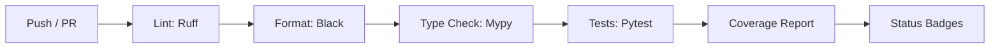

# Development Guide

This guide provides instructions for setting up a development environment and contributing to Thulium.

## Prerequisites

- Python 3.10 or higher
- Git
- Optional: CUDA-compatible GPU for accelerated training/inference

## Development Setup

### Clone and Install

```bash
git clone https://github.com/olaflaitinen/Thulium.git
cd Thulium
pip install -e .[dev]
```

### Pre-commit Hooks

Install pre-commit hooks to ensure code quality:

```bash
pre-commit install
```

This enables automatic formatting and linting on each commit.

---

## Code Quality Tools

### Formatting with Black

```bash
black thulium tests
```

Configuration in `pyproject.toml`:
- Line length: 88 characters
- Target version: Python 3.10

### Linting with Ruff

```bash
ruff check thulium tests
ruff check thulium tests --fix  # Auto-fix issues
```

### Type Checking with Mypy

```bash
mypy thulium
```

---

## Testing

### Running Tests

```bash
# Run all tests
pytest

# Run with coverage
pytest --cov=thulium --cov-report=html

# Run specific test file
pytest tests/test_basic.py -v

# Run tests matching pattern
pytest -k "language" -v
```

### Test Structure

```
tests/
    test_basic.py           # Core functionality tests
    test_api.py             # API layer tests
    test_pipeline.py        # Pipeline tests
    test_language_profiles.py  # Language support tests
```

### Writing Tests

- Use pytest fixtures for common setup
- Mark slow tests with `@pytest.mark.slow`
- Mock external dependencies (models, files)

---

## CI Pipeline



### GitHub Actions Workflow

The CI pipeline runs on every push and pull request:

1. **Lint**: Check code style with Ruff
2. **Format**: Verify Black formatting
3. **Type Check**: Run Mypy (warnings only)
4. **Test**: Run pytest with coverage
5. **Report**: Upload coverage to Codecov

---

## Project Structure

```
thulium/
    api/                # High-level API functions
    cli/                # Command-line interface
    data/               # Data loading and language profiles
    evaluation/         # Metrics and benchmarking
    models/             # PyTorch model implementations
        backbones/      # Feature extractors
        decoders/       # Output decoders
        language_models/# Language model scoring
        segmentation/   # Layout analysis models
        sequence/       # Sequence modeling heads
        wrappers/       # High-level model wrappers
    pipeline/           # Processing pipelines
    xai/                # Explainability tools
    version.py          # Version string
    __init__.py         # Package initialization
```

---

## Adding Features

### Adding a New Language

1. Define character set in `thulium/data/language_profiles.py`
2. Create `LanguageProfile` entry with appropriate settings
3. Optionally add pipeline config in `config/pipelines/`
4. Add tests for the new language
5. Update documentation

### Adding a Model Component

1. Create module in appropriate subdirectory
2. Implement base class interface
3. Register in `__init__.py` exports
4. Add unit tests
5. Document in API reference

---

## Debugging

### Verbose Logging

```python
import logging
logging.basicConfig(level=logging.DEBUG)

from thulium.api import recognize_image
result = recognize_image("test.png", language="en")
```

### CLI Debug Mode

```bash
thulium recognize test.png -l en -v
```

---

## Performance Profiling

```python
import cProfile
import pstats

cProfile.run('recognize_image("test.png")', 'profile.stats')
stats = pstats.Stats('profile.stats')
stats.sort_stats('cumulative').print_stats(20)
```
