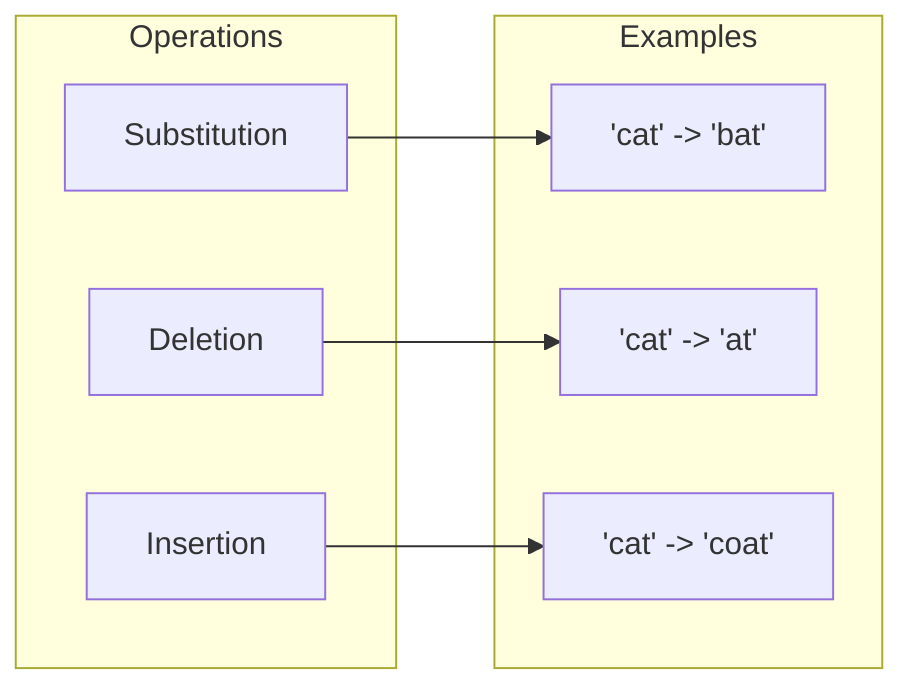
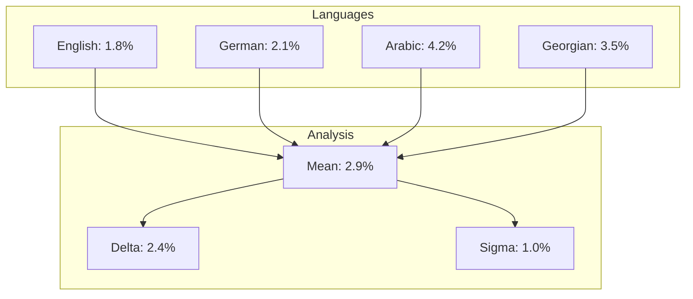
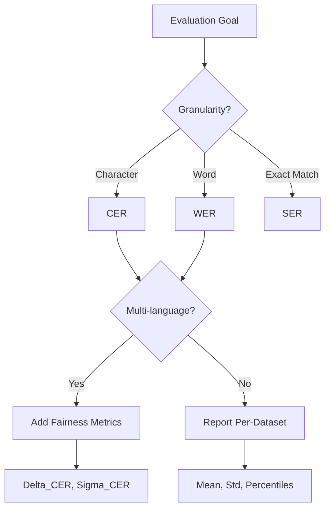

# Evaluation Metrics

Thulium implements a comprehensive suite of evaluation metrics for handwriting text recognition, following established standards in the HTR research community.

---

## Table of Contents

- [Error Rate Metrics](#error-rate-metrics)
- [Edit Distance Theory](#edit-distance-theory)
- [Performance Metrics](#performance-metrics)
- [Fairness Metrics](#fairness-metrics)
- [Statistical Analysis](#statistical-analysis)
- [API Reference](#api-reference)

---

## Error Rate Metrics

### Character Error Rate (CER)

The Character Error Rate quantifies recognition accuracy at the character level using the Levenshtein distance.

**Definition:**

```
CER = (S + D + I) / N
```

Where:
- **S** = Number of character substitutions
- **D** = Number of character deletions  
- **I** = Number of character insertions
- **N** = Total characters in reference string

**Properties:**

| Property | Value |
|:---------|:------|
| Range | [0, inf) |
| Optimal | 0.0 |
| Unit | Ratio or percentage |

> [!NOTE]
> CER can exceed 1.0 when insertions exceed the reference length.

**Example:**

```python
from thulium.evaluation.metrics import cer

reference = "The quick brown fox"
hypothesis = "The quich brown fax"

error_rate = cer(reference, hypothesis)
# Substitutions: 'k'->'h', 'o'->'a' = 2
# Reference length: 19
# CER = 2/19 = 0.1053 (10.53%)
```

---

### Word Error Rate (WER)

The Word Error Rate applies edit distance computation at the word level.

**Definition:**

```
WER = (S_w + D_w + I_w) / N_w
```

Where:
- **S_w** = Word substitutions
- **D_w** = Word deletions
- **I_w** = Word insertions
- **N_w** = Reference word count

**Properties:**

| Property | Value |
|:---------|:------|
| Range | [0, inf) |
| Optimal | 0.0 |
| Granularity | Word-level |

**Comparison with CER:**

| Metric | Sensitivity | Use Case |
|:-------|:------------|:---------|
| CER | Character-level | Fine-grained analysis |
| WER | Word-level | Document quality assessment |

---

### Sequence Error Rate (SER)

Binary metric indicating exact sequence match.

**Definition:**

```
SER = 0 if reference == hypothesis else 1
```

**Properties:**

| Property | Value |
|:---------|:------|
| Range | {0, 1} |
| Optimal | 0.0 |
| Strictness | Maximum |

---

## Edit Distance Theory

### Levenshtein Distance

The Levenshtein distance computes the minimum number of single-character edits required to transform one string into another.

**Recursive Definition:**

```
lev(a, b) = 
  |a|                           if |b| = 0
  |b|                           if |a| = 0
  lev(tail(a), tail(b))         if head(a) = head(b)
  1 + min(
    lev(tail(a), b),            # deletion
    lev(a, tail(b)),            # insertion  
    lev(tail(a), tail(b))       # substitution
  )                             otherwise
```

**Dynamic Programming Complexity:**

| Aspect | Complexity |
|:-------|:-----------|
| Time | O(mn) |
| Space | O(min(m, n)) |

Where m and n are the lengths of the two strings.

### Edit Operation Classification



---

## Performance Metrics

### Latency

Inference time per sample or batch.

**Definition:**

```
Latency = t_end - t_start
```

**Percentile Metrics:**

| Metric | Description |
|:-------|:------------|
| P50 | Median latency |
| P90 | 90th percentile |
| P99 | 99th percentile |

### Throughput

Processing rate in samples per unit time.

**Definition:**

```
Throughput = N_samples / T_total
```

**Units:**

| Unit | Description |
|:-----|:------------|
| samples/sec | Samples per second |
| lines/sec | Text lines per second |
| pages/min | Document pages per minute |

### Memory Usage

Peak memory consumption during inference.

```python
from thulium.evaluation.metrics import LatencyMeter

meter = LatencyMeter()

for batch in dataloader:
    with meter.measure():
        result = model(batch)

print(f"Mean: {meter.mean():.2f}ms")
print(f"P90: {meter.percentile(90):.2f}ms")
```

---

## Fairness Metrics

### Cross-Language Performance Variance

To ensure language parity, Thulium tracks performance distribution across languages.

**CER Range:**

```
Delta_CER = max_l(CER_l) - min_l(CER_l)
```

**CER Standard Deviation:**

```
Sigma_CER = sqrt(1/L * sum_l(CER_l - mean_CER)^2)
```

Where:
- L = Number of languages
- CER_l = CER for language l
- mean_CER = Average CER across languages

**Interpretation:**

| Delta_CER | Interpretation |
|:----------|:---------------|
| < 2% | Excellent parity |
| 2-5% | Good parity |
| 5-10% | Moderate disparity |
| > 10% | Significant disparity |

### Fairness Visualization



---

## Statistical Analysis

### Confidence Intervals

For robust evaluation, compute confidence intervals using bootstrap sampling:

```python
from thulium.evaluation.metrics import bootstrap_ci

cer_values = [0.02, 0.018, 0.023, 0.019, 0.021]
lower, upper = bootstrap_ci(cer_values, confidence=0.95)
print(f"95% CI: [{lower:.4f}, {upper:.4f}]")
```

### Significance Testing

Compare model performance using paired tests:

| Test | Use Case |
|:-----|:---------|
| Paired t-test | Normal distribution, many samples |
| Wilcoxon signed-rank | Non-parametric, paired samples |
| McNemar's test | Binary outcomes (correct/incorrect) |

---

## API Reference

### Core Functions

```python
from thulium.evaluation.metrics import (
    cer,                  # Character Error Rate
    wer,                  # Word Error Rate
    ser,                  # Sequence Error Rate
    cer_wer_batch,        # Batch computation
    get_edit_operations,  # Edit operation breakdown
    precision_recall_f1,  # Classification metrics
)
```

### Latency Utilities

```python
from thulium.evaluation.metrics import (
    LatencyMeter,         # Timing utility
    throughput,           # Throughput calculation
)
```

### Usage Examples

**Single Pair Evaluation:**

```python
reference = "Hello World"
hypothesis = "Hello world"

print(f"CER: {cer(reference, hypothesis):.4f}")
print(f"WER: {wer(reference, hypothesis):.4f}")
print(f"SER: {ser(reference, hypothesis):.4f}")
```

**Batch Evaluation:**

```python
references = ["text one", "text two", "text three"]
hypotheses = ["text one", "text too", "txt three"]

batch_cer, batch_wer = cer_wer_batch(references, hypotheses)
print(f"Batch CER: {batch_cer:.4f}")
print(f"Batch WER: {batch_wer:.4f}")
```

**Edit Operation Analysis:**

```python
ops = get_edit_operations("hello", "hallo")
print(f"Substitutions: {ops['substitutions']}")
print(f"Deletions: {ops['deletions']}")
print(f"Insertions: {ops['insertions']}")
```

---

## Metric Selection Guidelines



---

## Benchmark Standards

| Dataset | Language | State-of-the-Art CER | State-of-the-Art WER |
|:--------|:---------|---------------------:|---------------------:|
| IAM | English | 2.5-3.5% | 6-9% |
| RIMES | French | 1.5-3.0% | 5-8% |
| Washington | English (historical) | 3-6% | 10-18% |
| Bentham | English (historical) | 3-5% | 8-14% |
| CVL | German | 2-4% | 7-12% |

---

## References

1. Levenshtein, V. I. (1966). Binary codes capable of correcting deletions, insertions, and reversals.
2. Morris, A., Maier, V., Green, P. (2004). From WER and RIL to MER and WIL.
3. Graves, A., et al. (2006). Connectionist temporal classification.
